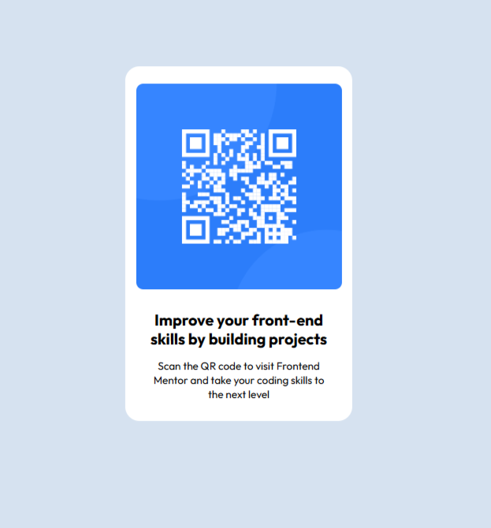

# Frontend Mentor - QR code component solution

This is a solution to the [QR code component challenge on Frontend Mentor](https://www.frontendmentor.io/challenges/qr-code-component-iux_sIO_H). Frontend Mentor challenges help you improve your coding skills by building realistic projects.

## Table of contents

- [Overview](#overview)
  - [Screenshot](#screenshot)
  - [Links](#links)
  - [Built with](#built-with)
  - [What I learned](#what-i-learned)
- [Author](#author)

## Overview

Frontend Mentor QR Component challenge

### Screenshot

### Links

- Solution URL: [pauliCodes-x](https://github.com/pauliCodes-x/qr-component)
- Live Site URL: [pauliCodes-x](https://pauliCodes-x.github.io/qr-component)

### Built with

- Semantic HTML5 markup
- CSS custom properties
- Flexbox

### What I learned

I tried to follow the design to achieve a good result.

## Author

- GitHub - [pauliCodex-x](https://github.com/pauliCodes-x)
- Frontend Mentor - [@pauliCodes-x](https://www.frontendmentor.io/profile/pauliCodes-x)
